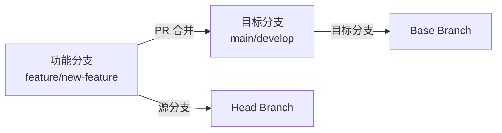

# GitHub PR 分支管理最佳实践

## 🎯 核心概念：源分支与目标分支

### 基本定义

- **源分支（Head Branch）**：您的功能分支，包含要合并的新代码
- **目标分支（Base Branch）**：接收代码的分支，PR 合并的目标



## 🔧 创建 PR 时指定目标分支

### 方法 1：明确指定（推荐）

```bash
# 基本语法
gh pr create --base <目标分支> --head <源分支> --title "标题"

# 实际示例
gh pr create --base main --head feature/user-auth --title "feat: 用户认证功能"
gh pr create --base develop --head feature/payment --title "feat: 支付功能"
gh pr create --base release/v2.0 --head hotfix/bug-fix --title "fix: 紧急bug修复"
```

### 方法 2：使用默认规则

```bash
# 简化命令（不指定 --base）
gh pr create --title "feat: 新功能"

# 默认目标分支选择规则：
# 1. 当前分支是 main/master → 目标分支 = main/master
# 2. 当前分支有上游分支 → 目标分支 = 上游分支
# 3. 以上都不满足 → 目标分支 = 仓库默认分支
```

## 🔍 查看和验证 PR 分支关系

### 快速查看分支关系

```bash
# 方法 1：JSON 格式查看
gh pr view 1 --json baseRefName,headRefName

# 输出示例：
{
  "baseRefName": "develop",                 # 目标分支
  "headRefName": "feature/user-auth"        # 源分支
}

# 方法 2：详细信息查看
gh pr view 1
# 会显示类似：feature/user-auth → develop
```

### 批量查看多个 PR

```bash
# 查看所有 PR 的分支关系
gh pr list --json number,title,baseRefName,headRefName

# 输出示例：
[
  {
    "number": 1,
    "title": "feat: 添加乘法功能",
    "baseRefName": "master",
    "headRefName": "feature/multiply-function"
  },
  {
    "number": 3,
    "title": "feat: 添加幂运算功能",
    "baseRefName": "develop",
    "headRefName": "feature/power-function"
  }
]
```

## ⚠️ 合并时的重要注意事项

### 常见误区

**❌ 错误做法：以为需要手动切换分支**
```bash
# 很多人以为需要这样做：
git checkout main          # 切换到目标分支
git pull origin main       # 拉取最新代码
gh pr merge 1 --squash     # 然后合并

# 实际上这是多余的！
```

**✅ 正确做法：直接合并**
```bash
# GitHub CLI 会自动处理一切
gh pr merge 1 --squash --delete-branch

# 无论您当前在哪个分支，GitHub 都会：
# 1. 识别 PR 的目标分支
# 2. 自动切换到目标分支
# 3. 执行合并操作
# 4. 推送到远程仓库
# 5. 更新本地分支（如果需要）
```

### 合并前的检查清单

```bash
# 1. 确认分支关系
gh pr view <PR号> --json baseRefName,headRefName

# 2. 查看代码差异
gh pr diff <PR号>

# 3. 检查 PR 状态
gh pr status

# 4. 查看检查结果
gh pr checks <PR号>

# 5. 执行合并
gh pr merge <PR号> --squash --delete-branch
```

## 🔄 不同工作流的分支策略

### 1. GitHub Flow（简化工作流）

```bash
# 所有功能都直接合并到 main
gh pr create --base main --title "feat: 新功能"
gh pr merge 1 --squash --delete-branch

# 流程：feature → main
```

### 2. Git Flow（复杂工作流）

```bash
# 功能开发 → develop
gh pr create --base develop --title "feat: 用户管理"
gh pr merge 1 --squash --delete-branch

# 发布准备 → main
gh pr create --base main --title "release: v2.0.0"
gh pr merge 2 --merge --delete-branch

# 紧急修复 → main
gh pr create --base main --title "hotfix: 安全漏洞"
gh pr merge 3 --squash --delete-branch

# 修复同步 → develop
gh pr create --base develop --title "chore: 同步hotfix到develop"
gh pr merge 4 --merge --delete-branch
```

### 3. 发布分支工作流

```bash
# 功能开发 → develop
gh pr create --base develop --title "feat: 支付功能"

# 发布分支 → main
gh pr create --base main --title "release: v1.2.0"

# 发布后修复 → release/v1.2.0
gh pr create --base release/v1.2.0 --title "fix: 发布后修复"
```

## 📊 实际演示案例

### 案例 1：多分支项目的 PR 管理

**项目结构**：
```
main (生产环境)
├── develop (开发环境)
├── release/v2.0 (发布分支)
└── hotfix/urgent-fix (紧急修复)
```

**实际操作**：
```bash
# 演示项目中的实际 PR
$ gh pr list --json number,title,baseRefName,headRefName
[
  {
    "number": 1,
    "title": "feat: 添加乘法功能",
    "baseRefName": "master",                    # 合并到 master
    "headRefName": "feature/multiply-function"
  },
  {
    "number": 2,
    "title": "feat: 添加除法功能",
    "baseRefName": "master",                    # 合并到 master
    "headRefName": "feature/divide-function"
  },
  {
    "number": 3,
    "title": "feat: 添加幂运算功能（目标：develop分支）",
    "baseRefName": "develop",                   # 合并到 develop
    "headRefName": "feature/power-function"
  }
]
```

### 案例 2：合并后的分支状态对比

**合并前的状态**：
```bash
# master 分支
$ git log --oneline master -3
e5b3a65 docs: add comprehensive collaboration guide
3b34cab feat: add comprehensive CI/CD workflows
b9756da feat: add divide function with error handling

# develop 分支
$ git log --oneline develop -3
e5b3a65 docs: add comprehensive collaboration guide
3b34cab feat: add comprehensive CI/CD workflows
b9756da feat: add divide function with error handling
```

**合并 PR #3 到 develop 后**：
```bash
# master 分支（无变化）
$ git log --oneline master -3
e5b3a65 docs: add comprehensive collaboration guide
3b34cab feat: add comprehensive CI/CD workflows
b9756da feat: add divide function with error handling

# develop 分支（新增幂运算功能）
$ git log --oneline develop -3
4744bed feat: add power function for exponentiation (#3)  ← 新增！
e5b3a65 docs: add comprehensive collaboration guide
3b34cab feat: add comprehensive CI/CD workflows
```

**验证结果**：
- ✅ PR #3 正确合并到 develop 分支
- ✅ master 分支保持不变
- ✅ 分支策略得到正确执行

## 🛠️ 实用工具和命令

### PR 分支管理工具箱

```bash
# 1. 查看当前仓库的默认分支
gh repo view --json defaultBranch

# 2. 列出所有分支
git branch -a

# 3. 查看分支关系图
git log --oneline --graph --all

# 4. 检查分支保护规则
gh api repos/:owner/:repo/branches/main/protection

# 5. 切换到 PR 分支进行测试
gh pr checkout <PR号>

# 6. 比较两个分支的差异
git diff main..develop

# 7. 查看 PR 的文件变更统计
gh pr view 1 --json additions,deletions,changedFiles
```

### 自动化脚本示例

```bash
#!/bin/bash
# PR 分支检查脚本

check_pr_branch() {
    local pr_number=$1
    
    echo "🔍 检查 PR #${pr_number} 的分支关系..."
    
    # 获取分支信息
    local branch_info=$(gh pr view $pr_number --json baseRefName,headRefName)
    local base_branch=$(echo $branch_info | jq -r '.baseRefName')
    local head_branch=$(echo $branch_info | jq -r '.headRefName')
    
    echo "📊 分支关系："
    echo "  源分支: $head_branch"
    echo "  目标分支: $base_branch"
    
    # 检查是否为预期的目标分支
    if [[ "$base_branch" == "main" || "$base_branch" == "master" ]]; then
        echo "⚠️  注意：即将合并到生产分支 ($base_branch)"
        echo "🤔 确认这是预期的操作吗？"
    elif [[ "$base_branch" == "develop" ]]; then
        echo "✅ 合并到开发分支，符合开发流程"
    else
        echo "💡 合并到自定义分支：$base_branch"
    fi
    
    # 显示代码变更统计
    echo "📈 代码变更统计："
    gh pr view $pr_number --json additions,deletions,changedFiles | \
        jq -r '"  新增行数: \(.additions)\n  删除行数: \(.deletions)\n  修改文件: \(.changedFiles)"'
}

# 使用示例
check_pr_branch 1
```

## 📋 分支管理检查清单

### 创建 PR 时

- [ ] 确认当前分支包含最新的目标分支代码
- [ ] 明确指定目标分支（`--base` 参数）
- [ ] 验证分支关系（`gh pr view --json baseRefName,headRefName`）
- [ ] 检查 PR 描述是否清晰说明变更内容

### 合并 PR 前

- [ ] 再次确认分支关系（避免合并到错误分支）
- [ ] 检查所有 CI/CD 检查是否通过
- [ ] 确认代码审查已完成
- [ ] 选择合适的合并策略（squash/rebase/merge）

### 合并 PR 后

- [ ] 验证目标分支已正确更新
- [ ] 检查功能在目标分支上正常工作
- [ ] 确认源分支已删除（如果设置了 `--delete-branch`）
- [ ] 通知相关团队成员合并完成

## 🎯 最佳实践总结

### 核心原则

1. **明确性优于隐式**：总是明确指定目标分支
2. **验证优于假设**：合并前必须验证分支关系
3. **自动化优于手动**：让 GitHub 处理分支切换和合并
4. **文档化优于记忆**：记录分支策略和工作流程

### 常用命令模板

```bash
# 创建功能 PR
gh pr create --base develop --title "feat: 功能描述" --body "详细描述"

# 创建发布 PR
gh pr create --base main --title "release: 版本号" --body "发布说明"

# 创建修复 PR
gh pr create --base main --title "hotfix: 修复描述" --body "问题详情"

# 验证并合并
gh pr view <PR号> --json baseRefName,headRefName
gh pr merge <PR号> --squash --delete-branch
```

### 团队协作建议

1. **统一分支命名规范**
2. **建立清晰的分支策略**
3. **定期清理无用分支**
4. **使用分支保护规则**
5. **培训团队成员正确使用**

通过遵循这些最佳实践，您的团队可以避免分支管理中的常见陷阱，确保代码合并到正确的分支，提高开发效率和代码质量。